#### Udacity Artificial Intelligence Nanodegree
### Term 2: Capstone Project
# Machine Translation with RNNs

##### &nbsp;

*Image credit: [xiandong79.github.io](https://xiandong79.github.io/seq2seq-%E5%9F%BA%E7%A1%80%E7%9F%A5%E8%AF%86)*

##### &nbsp;

## Goal
In this project, we build a deep neural network that functions as part of an end-to-end machine translation pipeline. The pipeline accepts English text as input and returns the French translation. The goal is to achieve the highest translation accuracy possible.

##### &nbsp;

## Background
The ability to communicate with one another is a fundamental part of being human. There are nearly 7,000 different languages worldwide. As our world becomes increasingly connected, language translation provides a critical cultural and economic bridge between people from different countries and ethnic groups. Some of the more obvious use-cases include:
- **business**: international investment, contracts, trade, and finance
- **commerce**: travel, purchase of foreign goods and services, customer support
- **media**: accessing information via search, sharing information via social networks, localization of content and advertising
- **education**: sharing of ideas, collaboration, translation of research papers
- **government**: foreign relations, negotiation  

To meet this need, technology companies are investing heavily in machine translation. This investment paired with recent advancements in deep learning have yielded major improvements in translation quality. According to Google, [switching to deep learning produced a 60% increase in translation accuracy](https://www.washingtonpost.com/news/innovations/wp/2016/10/03/google-translate-is-getting-really-really-accurate) compared to the phrase-based approach used previously. Today, translation applications from Google and Microsoft can translate over 100 different languages and are approaching human-level accuracy for many of them.

However, while machine translation has made a ton of progress, it's still not perfect. :grimacing:

##### &nbsp;

## Approach
To translate a corpus of English text to French, we need to build a recurrent neural network (RNN). Before diving into the implementation, let's first build some intuition of RNNs and why they're useful for NLP tasks.

#### RNN Overview
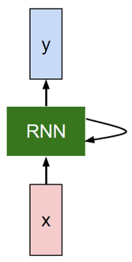
RNNs are designed to take sequences of text as inputs or return sequences of text as outputs, or both. They're called recurrent because, the network's hidden layers have a loop in which the output from one time step becomes an input at the next time step. This recurrence allows contextual information to flow through the network. It serves as a form of memory which can be applied to network operations at the current time step.

This is analogous to how we read. As you're reading this post, you're storing important pieces of information from previous words and sentences and using this context to understand each new word.

Other types of neural networks can't do this. Imagine you're using a convolutional neural network (CNN) to perform object detection in a movie. Currently, there's no way for information from objects detected in previous scenes to inform the model's detection of objects in the current scene. For example, if a courtroom and judge were detected in a previous scene, that information could help correctly classify the judge's gavel in the current scene (instead of misclassifying it as a hammer or mallet).

Depending on the use-case, you'll want to setup your RNN to handle inputs and outputs differently.

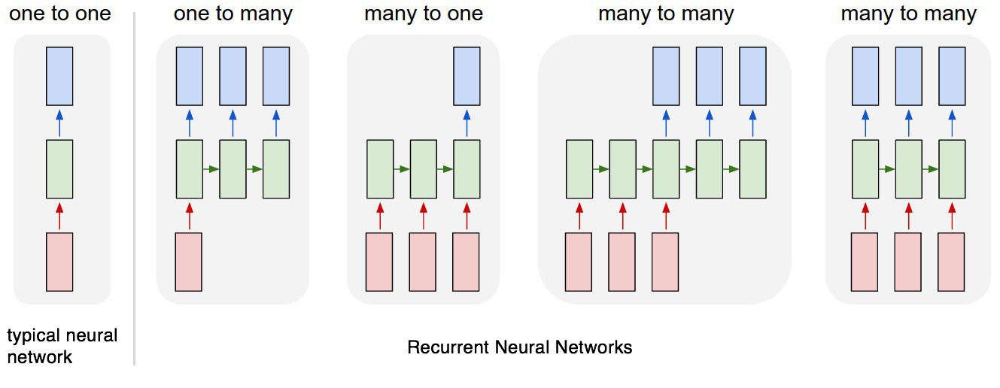
<Andrej Karpathy diagram of different sequence types>

> Each rectangle is a vector and arrows represent functions (e.g. matrix multiply). Input vectors are in red, output vectors are in blue and green vectors hold the RNN's state (more on this soon).

> From left to right: (1) Vanilla mode of processing without RNN, from fixed-sized input to fixed-sized output (e.g. image classification). (2) Sequence output (e.g. image captioning takes an image and outputs a sentence of words). (3) Sequence input (e.g. sentiment analysis where a given sentence is classified as expressing positive or negative sentiment). (4) Sequence input and sequence output (e.g. Machine Translation: an RNN reads a sentence in English and then outputs a sentence in French). (5) Synced sequence input and output (e.g. video classification where we wish to label each frame of the video). Notice that in every case are no pre-specified constraints on the lengths sequences because the recurrent transformation (green) is fixed and can be applied as many times as we like.

*Image and quote source: [karpathy.github.io](http://karpathy.github.io/2015/05/21/rnn-effectiveness/)*

##### &nbsp;

#### Building the Pipeline
Below is a summary of the various preprocessing and modeling steps. The high-level steps include:

1. Preprocessing: load and examine data, cleaning, tokenization, padding
1. Modeling: build, train, and test the model
1. Prediction: generate specific translations of English to French, and compare the output translations to the ground truth translations
1. Iteration: iterate on the model, experimenting with different architectures

For a more detailed walkthrough including the source code, check out the Jupyter notebook in the main directory ([machine_translation.ipynb](https://github.com/tommytracey/AIND-Capstone/blob/master/machine_translation.ipynb)).

#### Toolset
We use Keras with TensorFlow backend for this project. I prefer using Keras on top of TensorFlow because the syntax is simpler, which makes building the model layers more intuitive. However, there is a trade-off with Keras as you lose the ability to do fine-grained customizations. But this won't affect the models we're building in this project.  

##### &nbsp;

## Preprocessing

#### Load & Examine Data
Here is a sample of the data. The inputs are sentences in English; the outputs are the corresponding translation in French.

> 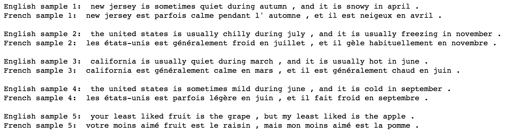

##### &nbsp;

When we run a word count, we can see that the vocabulary for the dataset is quite small. This was by design for this project, so that the models could be trained in a reasonable amount of time.

> 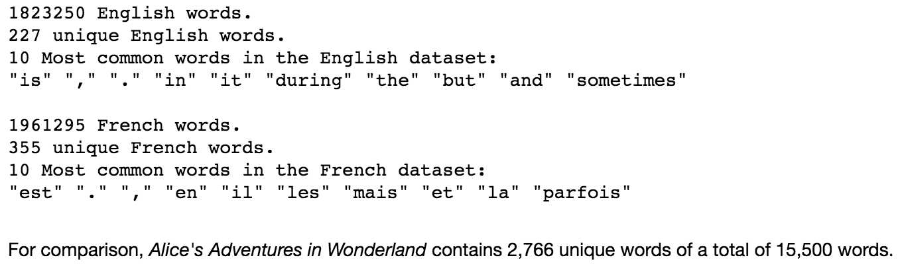

#### Cleaning
No additional cleaning needs to be done. The data has already been converted to lowercase and split so that there are spaces between all words and punctuation.

_Note:_ For other NLP projects you may need to perform additional steps such as: remove HTML tags, remove stop words, remove punctuation or convert to tag representations, label the parts of speech, or perform entity extraction.  

#### Tokenization
Next we need to tokenize the data, that is, to convert the text to numerical values. This allows the neural network to perform operations on the input data. For this project, each word and punctuation mark will be given a unique ID. (In other NLP projects, it might make sense to assign character-level IDs.)

When we run the tokenizer, it creates a word index, which we then use to convert each sentence to a vector.

> 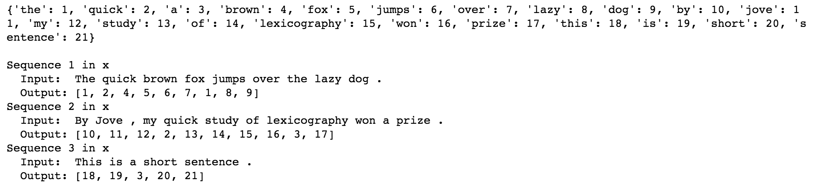

#### Padding
When we feed our sequences of word IDs into the model, each sequence needs to be the same length. To achieve this, padding is added to any sequence that is shorter than the max length (i.e. shorter than the longest sentence).

> 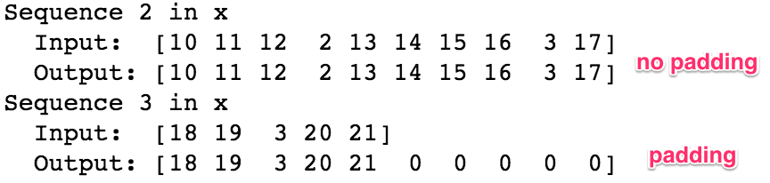

#### One-hot Encoding (not used)
In this project, our input sequences will be a series of integers representing the series of words (as seen above). However, sometimes an additional step is perform to convert each word integer from the input sequence into a one-hot encoded vector. We don't use one-hot encoding (OHE) in this project, but you'll see it in some of the diagrams, so I don't want you to get confused.  

One of the drawbacks of OHE is that the vectors can be very long and sparse. The length of the vector is determined by the vocabulary, i.e. the number of unique words in your text corpus. As we saw in the data examination step above, our vocabulary for this project is very small&mdash;only 227 English words and 355 French words. By comparison, the [Oxford English Dictionary has 172,000 words](https://en.oxforddictionaries.com/explore/how-many-words-are-there-in-the-english-language/), _not_ including various proper nouns, words tenses, and slang. If this was your vocabulary, your OHE vector would include only one true value surrounded by 171,999 zeros!

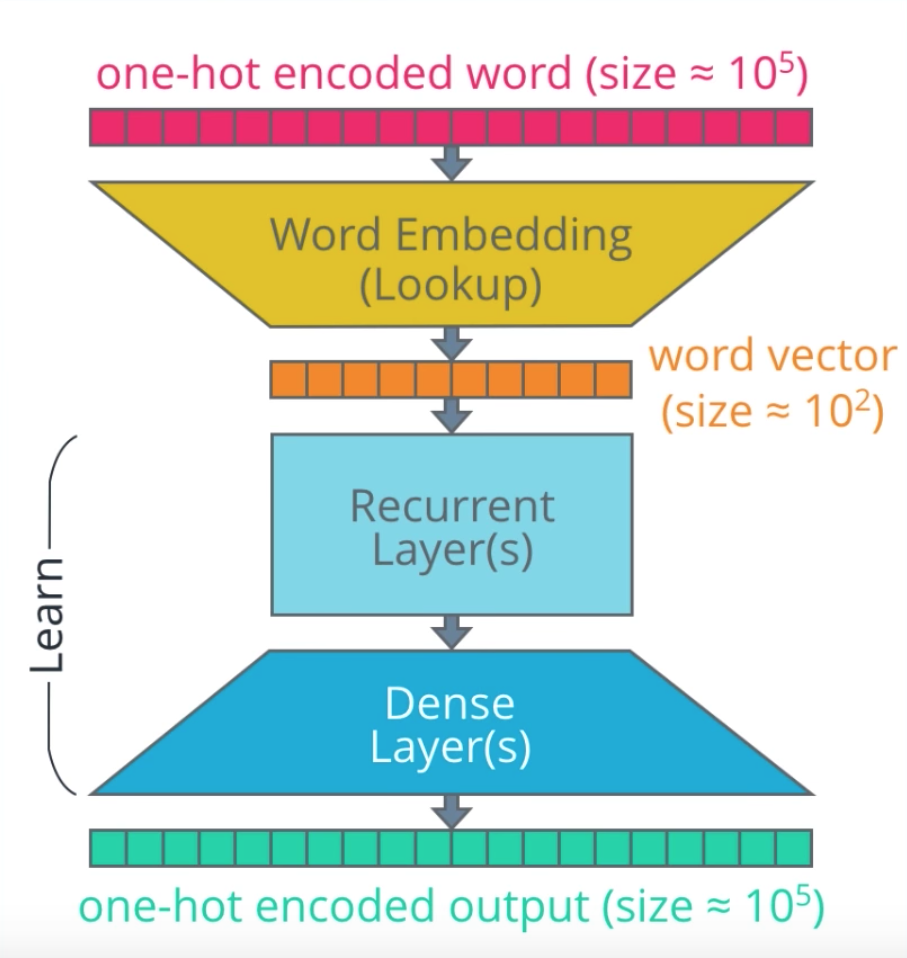

##### &nbsp;

## Modeling
_UNDER CONSTRUCTION: final version coming soon_

First, let's breakdown the architecture of a simple RNN.

#### Embeddings
Embeddings are a form of transfer learning which projects each word into a n-dimensional space. Words with similar meanings occupy similar regions of this space; the closer two words are, the more similar they are along those dimensions. And, the vectors between words often represents useful relationships, such as gender, verb tense, or even geo-political relationships.

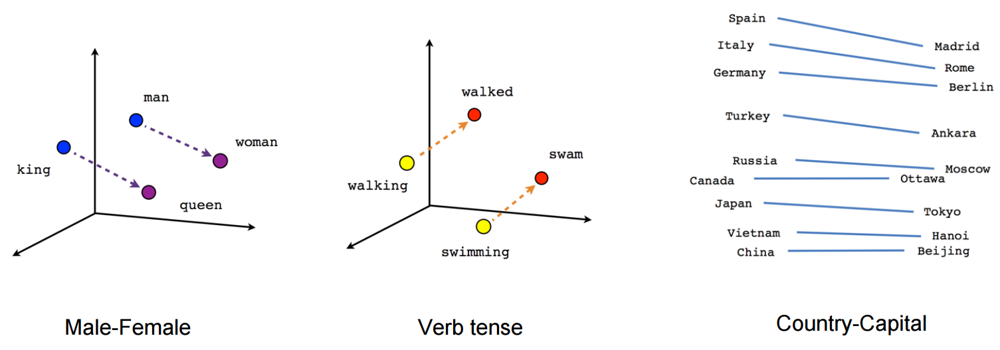

#### Encoder & Decoder
- encoder = recurrent layers
- decoder = dense layers
- time steps

##### &nbsp;
##### &nbsp;
##### &nbsp;
##### &nbsp;

##### &nbsp;
##### &nbsp;
##### &nbsp;

#### Gated recurrent unit (GRU)
##### &nbsp;

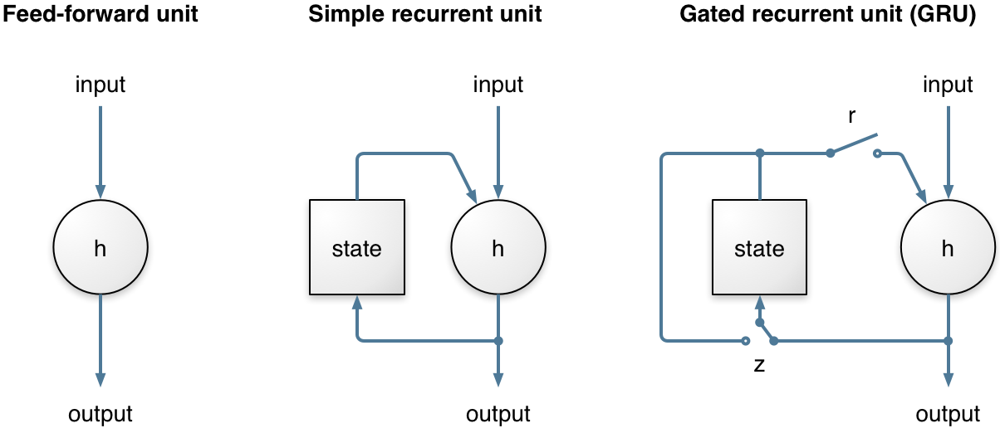

##### &nbsp;
##### &nbsp;
##### &nbsp;

#### Bidirectional Layer
- backward and forward context

##### &nbsp;
##### &nbsp;
##### &nbsp;

#### LSTM
- Not tested in this project, but done is separate Udacity project found [here](https://github.com/tommytracey/udacity/tree/master/deep-learning-nano/projects/4-language-translation#build-the-neural-network)

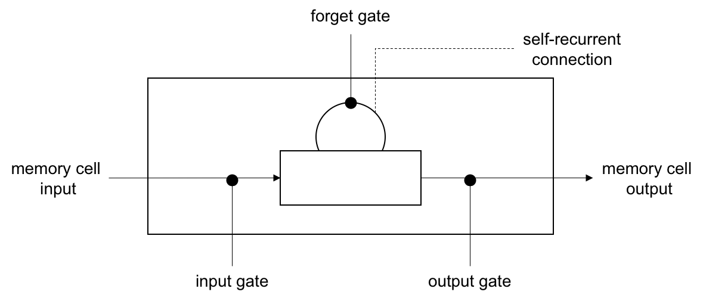

##### &nbsp;
##### &nbsp;

#### Attention (not tested)

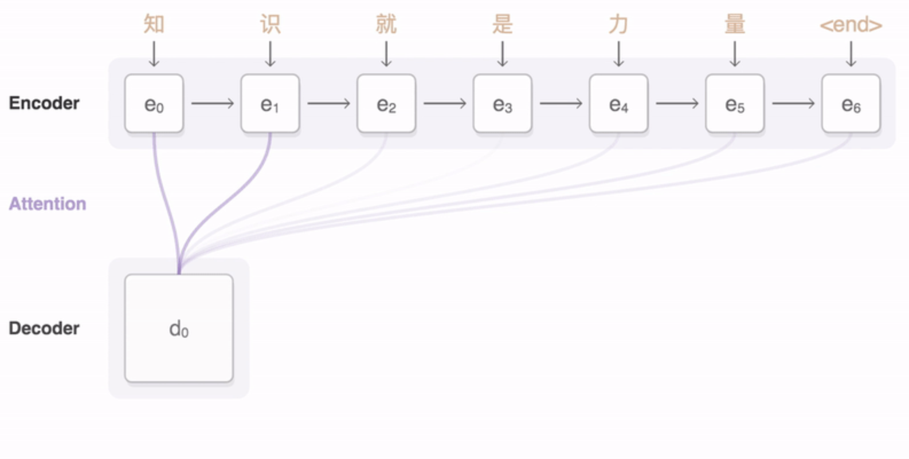

##### &nbsp;
##### &nbsp;
##### &nbsp;

## Results
_UNDER CONSTRUCTION: final version coming soon_

##### &nbsp;

## Future Improvements
_UNDER CONSTRUCTION: final version coming soon_

- do proper data split (train, validation, test)
- LSTM + attention
- Residual layers (Google paper)
- Embedding Language Model (ELMo)
- Transformer model
- train on different text corpuses

##### &nbsp;
##### &nbsp;

---

# Project Starter Code
In case you want to run this project yourself, below is the project starter code.

## Setup
The original Udacity repo for this project can be found [here]().

This project requires GPU acceleration to run efficiently. Support is available to use either of the following two methods for accessing GPU-enabled cloud computing resources.

### Udacity Workspaces (Recommended)

Udacity Workspaces provide remote connection to GPU-enabled instances right from the classroom. Refer to the classroom lesson for this project to find an overview of navigating & using Jupyter notebook Workspaces.

### Amazon Web Services (Optional)

Please refer to the Udacity instructions for setting up a GPU instance for this project, and refer to the project instructions in the classroom for setup. The recommended AMI should include compatible versions of all required software and libraries to complete the project. [link for AIND students](https://classroom.udacity.com/nanodegrees/nd889/parts/16cf5df5-73f0-4afa-93a9-de5974257236/modules/53b2a19e-4e29-4ae7-aaf2-33d195dbdeba/lessons/2df3b94c-4f09-476a-8397-e8841b147f84/project)

### Install
- Python 3
- NumPy
- TensorFlow 1.x
- Keras 2.x

## Submission
When you are ready to submit your project, do the following steps:
1. Ensure you pass all points on the [rubric](https://review.udacity.com/#!/rubrics/1004/view).
2. Submit the following in a zip file:
  - `helper.py`
  - `machine_translation.ipynb`
  - `machine_translation.html`

### Converting to HTML

There are several ways to generate an HTML copy of the notebook:

 - Running the last cell of the notebook will export an HTML copy

 - Navigating to **File -> Download as -> HTML (.html)** within the notebook

 - Using `nbconvert` from the command line

    $ pip install nbconvert
    $ nbconvert machine_translation.ipynb
